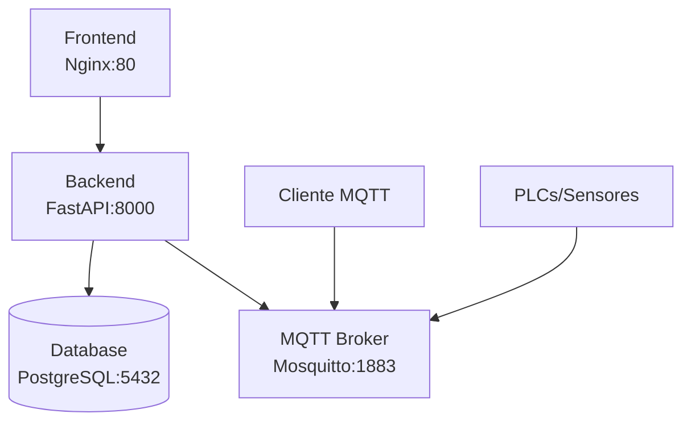

# 🏭 SCADA Pro v0.1.0 - Docker Deployment Guide

> **Guía completa para desplegar SCADA Pro usando Docker y Docker Compose**

## 📋 Tabla de Contenidos

- [Inicio Rápido](#-inicio-rápido)
- [Arquitectura Docker](#-arquitectura-docker)
- [Configuración](#-configuración)
- [Despliegue](#-despliegue)
- [Monitoreo y Mantenimiento](#-monitoreo-y-mantenimiento)
- [Solución de Problemas](#-solución-de-problemas)
- [Producción](#-producción)

## 🚀 Inicio Rápido

### Opción A: Stack Completo (Recomendado para Producción)

```bash
# 1. Clonar repositorio
git clone https://github.com/your-org/SCADApro.git
cd SCADApro

# 2. Configurar entorno
cp .env.example .env
# Editar .env según tus necesidades

# 3. Desplegar
docker-compose up -d --build

# 4. Verificar
docker-compose ps
open http://localhost
```

### Opción B: Solo Frontend (Backend Externo)

```bash
# Para desarrollo o cuando el backend ya existe
docker-compose -f docker-compose.frontend-only.yml up -d --build

# Configurar backend externo si es necesario
echo "BACKEND_HOST=tu-servidor-backend" >> .env
```

## 🏗️ Arquitectura Docker

### Servicios del Stack Completo



### Imágenes y Puertos

| Servicio | Imagen | Puerto Interno | Puerto Externo | Descripción |
|----------|--------|-----------------|----------------|-------------|
| **Frontend** | `scada-pro:latest` | 80 | 80 | Dashboard SCADA (Nginx) |
| **Backend** | `backend:latest` | 8000 | 8000 | API REST + WebSocket |
| **Database** | `postgres:15` | 5432 | 5432 | PostgreSQL |
| **MQTT** | `eclipse-mosquitto:latest` | 1883/9001 | 1883/9001 | Broker MQTT |

## ⚙️ Configuración

### Variables de Entorno

Crear archivo `.env` basado en `.env.example`:

```bash
cp .env.example .env
```

#### Variables Principales

```bash
# Base de Datos PostgreSQL
DB_USER=backend
DB_PASSWORD=tu_password_seguro
DB_NAME=industrial

# API Token (para autenticación con APIs externas)
API_TOKEN=tu_token_de_api

# Backend (solo para docker-compose.frontend-only.yml)
BACKEND_HOST=10.147.18.10
BACKEND_PORT=8000

# Imagen del Backend (opcional)
BACKEND_IMAGE=tu-registry/backend:latest
```

### Configuración MQTT

El broker MQTT viene pre-configurado en `mosquitto/config/mosquitto.conf`:

```conf
# Configuración básica
listener 1883
protocol mqtt

# WebSocket para navegador
listener 9001
protocol websockets

# Autenticación (opcional)
# password_file /mosquitto/config/password.txt
# acl_file /mosquitto/config/acl.txt
```

## 🚀 Despliegue

### Stack Completo

```bash
# Construir y ejecutar todos los servicios
docker-compose up -d --build

# Ver logs de todos los servicios
docker-compose logs -f

# Ver logs de un servicio específico
docker-compose logs -f frontend
docker-compose logs -f backend

# Detener servicios
docker-compose down

# Detener y eliminar volúmenes (⚠️  Borra datos!)
docker-compose down -v
```

### Solo Frontend

```bash
# Construir imagen del frontend
docker build -t scada-pro:latest .

# Ejecutar contenedor
docker run -d \
  --name scada-frontend \
  -p 80:80 \
  -e BACKEND_HOST=10.147.18.10 \
  -e BACKEND_PORT=8000 \
  scada-pro:latest

# O usando docker-compose
docker-compose -f docker-compose.frontend-only.yml up -d --build
```

### Rebuild Selectivo

```bash
# Solo frontend
docker-compose up -d --build frontend

# Solo backend
docker-compose up -d --build backend

# Forzar rebuild completo
docker-compose build --no-cache
```

## 🔍 Monitoreo y Mantenimiento

### Health Checks

```bash
# Ver estado de contenedores
docker-compose ps

# Health checks manuales
curl http://localhost/health              # Frontend
curl http://localhost:8000/api/health     # Backend
```

### Logs y Debugging

```bash
# Logs en tiempo real
docker-compose logs -f

# Últimas 100 líneas
docker-compose logs --tail=100

# Logs de un servicio específico
docker-compose logs -f backend

# Entrar a un contenedor
docker exec -it scada-frontend sh
docker exec -it scada-backend bash
```

### Gestión de Recursos

```bash
# Ver uso de recursos
docker stats

# Ver uso de disco
docker system df

# Limpiar imágenes no utilizadas
docker image prune -f

# Limpiar contenedores detenidos
docker container prune -f
```

### Backup y Restauración

```bash
# Backup de base de datos
docker exec scada-db pg_dump -U backend industrial > backup.sql

# Backup de configuraciones
docker run --rm -v scada_data:/data -v $(pwd):/backup alpine tar czf /backup/backup.tar.gz -C /data .

# Restaurar backup
docker run --rm -v scada_data:/data -v $(pwd):/backup alpine tar xzf /backup/backup.tar.gz -C /data
```

## 🔧 Solución de Problemas

### Problemas Comunes

#### Puerto ya en uso
```bash
# Ver qué proceso usa el puerto
netstat -tulpn | grep :80
lsof -i :80

# Cambiar puerto en docker-compose.yml
ports:
  - "8080:80"  # Cambiar 80 por 8080
```

#### Error de conexión a base de datos
```bash
# Verificar variables de entorno
docker-compose exec backend env | grep DB_

# Verificar conectividad
docker-compose exec backend nc -zv db 5432
```

#### Frontend no carga
```bash
# Verificar logs del frontend
docker-compose logs frontend

# Verificar archivos estáticos
docker exec scada-frontend ls -la /usr/share/nginx/html/
```

#### MQTT no conecta
```bash
# Verificar broker MQTT
docker-compose logs mqtt

# Probar conexión MQTT
docker run --rm --network scada-network eclipse-mosquitto mosquitto_sub -h mqtt -t "test"
```

### Debug Mode

```bash
# Ejecutar con logs detallados
docker-compose up --build

# Acceder al contenedor para debug
docker run -it --rm --entrypoint sh scada-pro:latest

# Ver variables de entorno en runtime
docker exec scada-frontend env
```

## 🏭 Producción

### Configuración de Producción

```yaml
# docker-compose.prod.yml
version: '3.8'
services:
  frontend:
    environment:
      - NODE_ENV=production
    deploy:
      resources:
        limits:
          memory: 512M
        reservations:
          memory: 256M

  backend:
    environment:
      - ENVIRONMENT=production
    deploy:
      replicas: 2
      resources:
        limits:
          memory: 1G
        reservations:
          memory: 512M
```

### Seguridad

```bash
# Usar secrets en lugar de variables de entorno
echo "tu_password_seguro" | docker secret create db_password -

# En docker-compose.yml
secrets:
  db_password:
    external: true

# Configurar HTTPS con Let's Encrypt
# Usar nginx con certbot o traefik
```

### Escalado

```bash
# Escalar servicios
docker-compose up -d --scale backend=3

# Balanceo de carga con nginx
upstream backend {
    server backend:8000;
    server backend2:8000;
    server backend3:8000;
}

server {
    listen 80;
    location /api {
        proxy_pass http://backend;
    }
}
```

### Monitoreo

```bash
# Prometheus + Grafana stack
# Agregar al docker-compose.yml
services:
  prometheus:
    image: prom/prometheus
    ports:
      - "9090:9090"

  grafana:
    image: grafana/grafana
    ports:
      - "3000:3000"
```

## 📊 Comandos Útiles

```bash
# Desarrollo
docker-compose -f docker-compose.dev.yml up -d

# Testing
docker-compose -f docker-compose.test.yml up --abort-on-container-exit

# CI/CD
docker build -t scada-pro:${GIT_COMMIT} .
docker tag scada-pro:${GIT_COMMIT} registry.example.com/scada-pro:latest
docker push registry.example.com/scada-pro:latest

# Limpieza
docker-compose down -v --remove-orphans
docker system prune -f
```

## 🎯 Checklist de Despliegue

- [ ] Repositorio clonado
- [ ] `.env` configurado
- [ ] Puertos libres verificados
- [ ] `docker-compose up -d --build` ejecutado
- [ ] Health checks pasan
- [ ] Aplicación accesible en http://localhost
- [ ] Logs sin errores críticos
- [ ] Backup configurado
- [ ] Monitoreo activo

## 📞 Soporte

Para problemas específicos:
1. Revisar logs: `docker-compose logs -f`
2. Verificar configuración: `docker exec <container> env`
3. Comprobar conectividad: `docker network inspect scada-network`
4. Consultar documentación: [Wiki del Proyecto](https://github.com/your-org/SCADApro/wiki)

---

**SCADA Pro v0.1.0** - Despliegue Docker completo y documentado 🐳

## Troubleshooting

### El frontend no conecta al backend

1. Verificar que el backend esté corriendo:
   ```bash
   curl http://10.147.18.10:8000/api/health
   ```

2. Si usas `nginx-external.conf`, verificar que la IP sea correcta

3. Revisar logs de nginx:
   ```bash
   docker exec -it scada-frontend cat /var/log/nginx/error.log
   ```

### WebSocket no conecta

1. Verificar que el proxy WebSocket esté configurado en nginx
2. Revisar que el backend tenga `/ws/realtime` disponible

### Base de datos no inicia

1. Verificar permisos del volumen:
   ```bash
   docker volume inspect frontend_postgres_data
   ```

2. Eliminar volumen y recrear:
   ```bash
   docker-compose down -v
   docker-compose up -d
   ```
